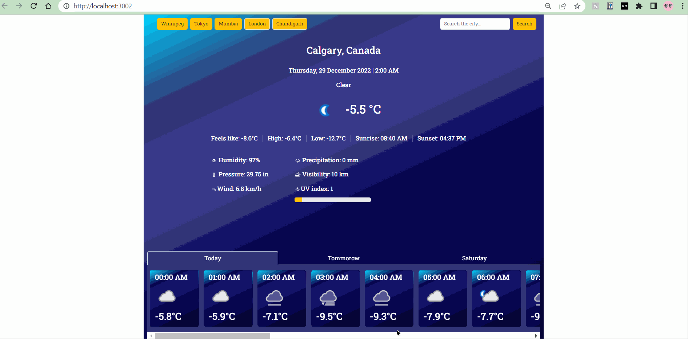

# Title: **Weather App**

## Purpose

Check the weather around you and all over the world at a glance. Rely on the accurate weather forecast and adjust your schedule to the weather coming in. You won’t even have to look out the window as the app will make you feel like you are already outside!

## Features
Weather is sometimes difficult to predict. This accurate weather app allows to find out a detailed forecast wherever you are, for any time of the day by tapping on the icons:

- Current and “Feels like” temperature
- Humidity.
- Wind speed.
- Pressure and Precipitation information.
- Sunrise/sunset time.
- Visibility.
- And UV index.

### Deployment
[Click here](https://garrys-weather-app.netlify.app/) to see the live preview.

## Motivation

The  main motivation behind this project was to make myself familiar with the use of APIs and the polish the react and bootstrap library skills. 
## Available Scripts

In the project directory, you can run:

### `npm start`

Runs the app in the development mode.\
Open [http://localhost:3000](http://localhost:3000) to view it in your browser.

The page will reload when you make changes.\
You may also see any lint errors in the console.

### `npm run build`

Builds the app for production to the `build` folder.\
It correctly bundles React in production mode and optimizes the build for the best performance.

### Advanced Configuration

This section has moved here: [https://facebook.github.io/create-react-app/docs/advanced-configuration](https://facebook.github.io/create-react-app/docs/advanced-configuration)

